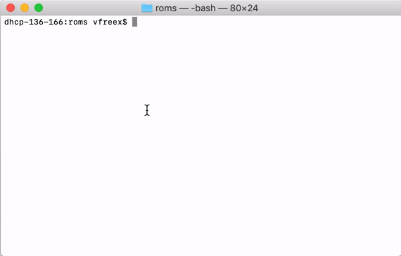
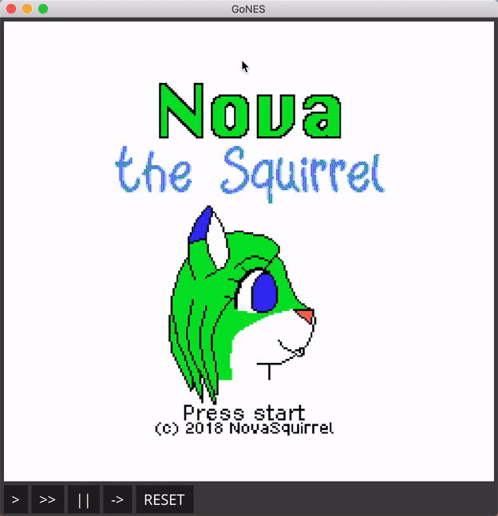

# GoNES: Yet Another NES Emulator Written in Go

Latest version: 0.3.0-beta

NOTE: This project is under active development.
Defects and bugs are expected.

## What is this?

A cross-platform and portable NES emulator written Go.

## Why choosing GoNES?

1. For developers who want to learn how this emulator works:  GoNES is optimized for code readability, not performance.
2. Yes, cross-platform!
3. Download and play: No runtime dependencies.

## Installation

### Prebuilt binaries
You can [download a prebuilt binary](https://github.com/vfreex/gones/releases).

### Build from source
```sh
go get -d github.com/vfreex/gones
make
```

## Usage
### Start GoNES
Run `gones` from terminal:
```sh
gones <game>.nes
```

Or if you are using GUI, just drag your `.NES` file to `gones` binary file.



Then the game will start:



## Default Keymap
### First Player
| NES Key           | PC                 | Mac          |
|-------------------|--------------------|--------------|
| <kbd>Start</kbd>  | <kbd>Enter</kbd>   | <kbd>↩</kbd> |
| <kbd>Select</kbd> | <kbd>Control</kbd> | <kbd>⌃</kbd> |
| <kbd>←</kbd>      | <kbd>Left</kbd>    | <kbd>←</kbd> |
| <kbd>→</kbd>      | <kbd>Right</kbd>   | <kbd>→</kbd> |
| <kbd>↑</kbd>      | <kbd>Up</kbd>      | <kbd>↑</kbd> |
| <kbd>↓</kbd>      | <kbd>Down</kbd>    | <kbd>↓</kbd> |
| <kbd>A</kbd>      | <kbd>X</kbd>       | <kbd>X</kbd> |
| <kbd>B</kbd>      | <kbd>Z</kbd>       | <kbd>Z</kbd> |


